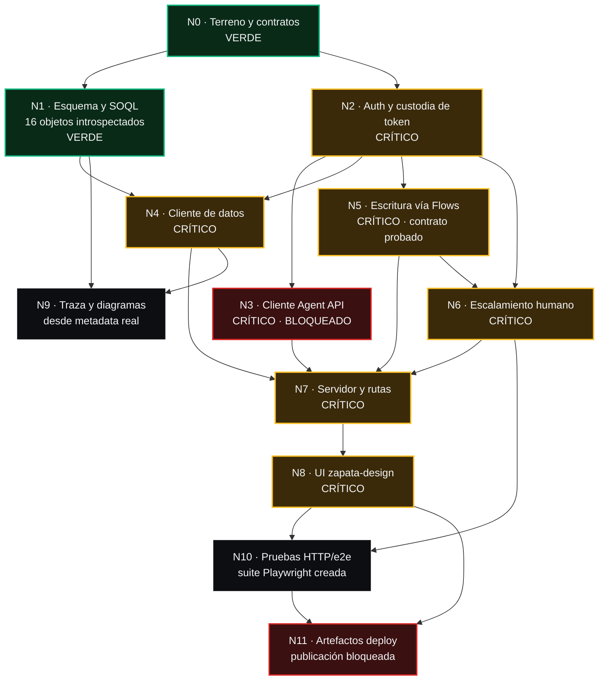

# Grafo de construcción

Las aristas son dependencias de datos consultados o escritos en la org: A → B significa que B no puede
verificarse sin la salida de A. Un nodo sin dependencias pendientes puede despacharse
en paralelo. **Ningún nodo se despacha si su padre no pasó verificación.**

La org contiene semilla sintética. «Contra la org» prueba integración y efecto, no que
flota, clientes, capacidad o pólizas sean datos reales de Zapata. Ver
`docs/DATOS-Y-PROVENIENCIA.md`.

Estado al 5 de agosto de 2026.

---

## Diagrama

**Camino crítico de la demo** — si uno falla, no hay demo:
`N2 → N4 → N5 → N6 → N7 → N8`, más `N3` para la sección Conversación.

`N3` está en rojo hasta custodiar las credenciales de la ECA activa y pasar el
lifecycle real (`BLOQUEOS.md` §1). **El resto del camino
crítico no depende de él**, que es la razón de que la demo siga siendo posible.

---

## Nodos

### N0 · Terreno y contratos — VERDE

- **Produce:** `00-CONTEXTO.md`, `docs/CONTRATO-AGENT-API.md`,
  `docs/CONTRATO-ESCALAMIENTO.md`, `BLOQUEOS.md`, `.env.example`
- **Depende de:** nada
- **Verificación:** 13 archivos crudos en `evidencia/00-terreno/`; contratos con fecha
  y enlace; los 4 Flows recuperados de la org
- **Estado:** VERDE

### N1 · Esquema y consultas SOQL — VERDE

- **Produce:** `scripts/describe-objetos.mjs`, `evidencia/05-esquema/`, y el módulo de
  consultas tipadas
- **Depende de:** N0
- **Verificación:** los 16 objetos responden `/describe`; **cada consulta de la app
  usa sólo nombres que aparecen en el describe**
- **Agente:** `database-reviewer` · **Revisa:** `type-design-analyzer`
- **Estado:** VERDE — introspección hecha, corrigió 4 nombres de campo que estaban mal
  supuestos (ver `00-CONTEXTO.md` §6)

### N2 · Auth y custodia de token — CRÍTICO

- **Produce:** `src/servidor/auth.ts` — interfaz `ProveedorDeToken` con dos
  implementaciones: `client_credentials` y `cli`
- **Depende de:** N0
- **Verificación:** un token válido obtiene HTTP 200 en `/services/data/v67.0/query`;
  **el token nunca aparece en una respuesta al navegador ni en un log**; al recibir 401
  se renueva y se reintenta una sola vez
- **Agente:** `api-connector-builder` · **Revisa:** `security-reviewer` (obligatorio
  antes de cualquier despliegue)

### N3 · Cliente de la Agent API — CRÍTICO · BLOQUEADO

- **Produce:** `src/servidor/agente.ts` — sesión, mensaje, streaming SSE, cierre
- **Depende de:** N2
- **Verificación:** abrir sesión devuelve `sessionId`; el streaming entrega `TextChunk`
  y `EndOfTurn`; el cierre devuelve `SessionEnded`
- **Estado:** **ROJO pendiente de verificación.** La ECA ya está activa; falta cargar
  su par consumidor fuera del chat y repetir el lifecycle. Los 404 históricos no
  demostraron una causa raíz única. El código **falla ruidosamente**: jamás inventa
  una respuesta
- **Agente:** `api-connector-builder` · **Revisa:** `silent-failure-hunter`

### N4 · Cliente de datos — CRÍTICO

- **Produce:** `src/servidor/datos.ts` — unidades, slots, órdenes, logs, cobertura,
  sucursales
- **Depende de:** N1, N2
- **Verificación:** cada consulta devuelve el estado de la org y conserva su etiqueta
  de proveniencia (Asset 15, Slot 729, WorkOrder 30, Varada 28 en la fotografía de
  cierre). Un cambio de conteo se reporta, no se rellena ni se oculta.
- **Agente:** `code-architect` · **Revisa:** `database-reviewer`

### N5 · Escritura vía Flows — CRÍTICO

- **Produce:** `src/servidor/flows.ts` — los 4 Flows con sus contratos exactos
- **Depende de:** N2
- **Verificación:** invocar y **releer el registro creado**; `varMotivoBloqueo`
  poblado se propaga a la UI como bloqueo de política, no como error
- **Estado:** contrato **ya probado** — `VAR-000026` + `LOG-00000124` con el mismo
  `Correlation_Id__c` (`evidencia/02-flows/`)
- **Agente:** `api-connector-builder` · **Revisa:** `silent-failure-hunter`

### N6 · Escalamiento humano — CRÍTICO

- **Produce:** `src/servidor/escalamiento.ts` + las dos vistas (cliente y asesor)
- **Depende de:** N2, N5
- **Verificación:** la prueba de aceptación de dos navegadores; los `CaseComment`
  existen en la org; hay `Log_Agente__c` con el mismo folio
- **Estado:** acción Agentforce + Apex + Torre **ya probados** — exactamente 1 Case,
  1 CaseComment interno y 1 Log correlacionados en la cola real
  (`evidencia/15-escalamiento-apex/` y `evidencia/16-agentforce-v10/`)
- **Agente:** `architect` · **Revisa:** `silent-failure-hunter`

### N7 · Servidor y rutas — CRÍTICO

- **Produce:** `src/servidor/index.ts`, rutas, `/salud` y `/api/admin/salud`
- **Depende de:** N3, N4, N5, N6
- **Verificación:** `/salud` sólo prueba liveness con `status`/`build` y no revela
  dependencias. `/api/admin/salud` exige rol `admin`, consulta el estado real de
  Salesforce y su monitor debe evaluar el campo `ok`, no sólo HTTP 200
- **Agente:** `code-architect` · **Revisa:** `typescript-reviewer`

### N8 · UI con zapata-design — CRÍTICO

- **Produce:** las 7 secciones sobre el shell inyectado
- **Depende de:** N7
- **Verificación:** `node skills/zapata-design/scripts/auditar-sistema.mjs <ruta>`
  con código 0 en **cada** ruta; sin scroll horizontal a 1440/768/390
- **Agente:** aplica la skill `zapata-design` · **Revisa:** el auditor + `react-reviewer`

### N9 · Traza y diagramas de arquitectura

- **Produce:** vista de traza por folio + mermaid **generado desde la metadata real**;
  cada acción enlaza con su Flow/Apex y con los objetos que lee o escribe
- **Depende de:** N1, N4
- **Verificación:** el diagrama se regenera desde la org y **cambia si la org cambia**;
  falla si una acción no tiene GenAiFunction recuperable o si el escalamiento no
  demuestra `Case + CaseComment + Log_Agente__c`; un diagrama dibujado a mano se rechaza
- **Agente:** `doc-updater` · **Revisa:** `code-explorer`

### N10 · Pruebas e2e

- **Produce hoy:** suite Playwright de rutas, UI, seguridad, protocolo Agent API y
  casos de integración contra la Developer Edition
- **Depende de:** N8, N6
- **Verificación actual:** 32/32 unitarias y 50/50 E2E ejecutadas; rutas HTTP, bindings
  Salesforce, UI móvil, seguridad, proveniencia y bloqueo de capacidad asumida
- **Pendiente:** 3 skips explícitos: lifecycle Agent API sin consumer pair, mutaciones
  positivas sin cleanup aprobado y nuevo escalamiento opt-in. No equivalen a una
  conversación Agent API exitosa ni se presentan como pases.
- **Agente:** `e2e-runner` · **Revisa:** `pr-test-analyzer`
- **Nota:** el caso de conversación queda rojo mientras N3 esté bloqueado. **No se
  sustituye por un mock**: se marca como bloqueado

### N11 · Despliegue

- **Produce hoy:** Dockerfile multi-stage, `.dockerignore`, Blueprint Render y runbook
- **Depende de:** N10, N8
- **Verificación actual:** build/arranque/healthcheck local y contrato de despliegue
- **Bloqueado:** no existe entorno remoto; falta rotar la contraseña expuesta,
  custodiar las credenciales de la ECA activa, completar Agent API, aceptar el
  proveedor de identidad y aprobar costo/publicación. Ver `BLOQUEOS.md` §0, §1, §2 y §6
- **Agente:** aplica `deployment-patterns` · **Revisa:** `security-reviewer`

---

## Orden de despacho

| Ola | Nodos | Por qué juntos |
|---|---|---|
| 0 | N0, N1 | Hechos. Sin esquema real todo lo demás adivina |
| 1 | N2 | Todo lo que habla con la org depende de él |
| 2 | N3, N4, N5 | Independientes entre sí una vez hay token |
| 3 | N6, N9 | N6 necesita N5; N9 necesita N4 |
| 4 | N7 | Junta a los cuatro clientes |
| 5 | N8 | Necesita rutas vivas |
| 6 | N10 | Necesita UI |
| 7 | N11 | Necesita pruebas en verde |

## Regla de salida por nodo

- **Verde:** la verificación pasa **y** su evidencia está en disco. No hay verde por
  "parece que ya".
- **Rojo:** 3 intentos con la **misma** causa raíz → a `BLOQUEOS.md` y se sigue con
  otro nodo. Ya ocurrió una vez, con N3.
- Prohibido bajar el criterio para que pase. Si una prueba estorba, se arregla el
  código.
